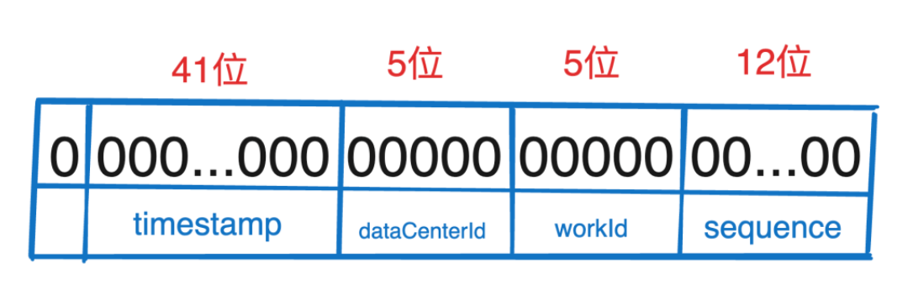
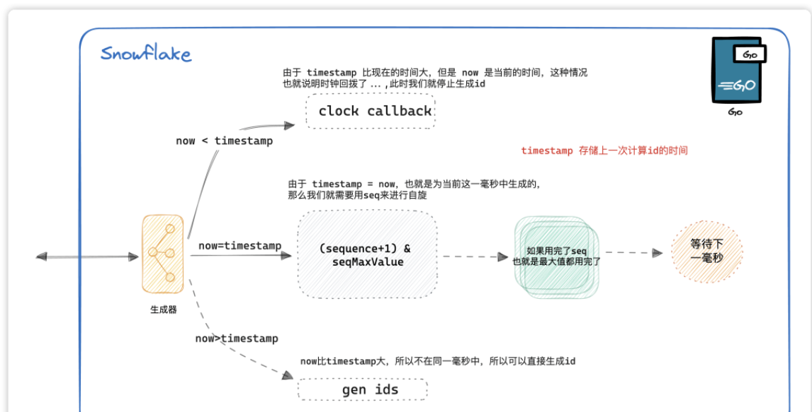
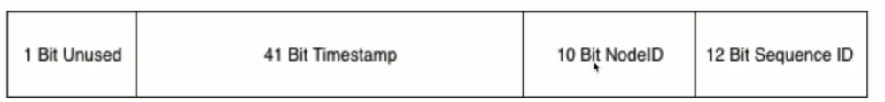
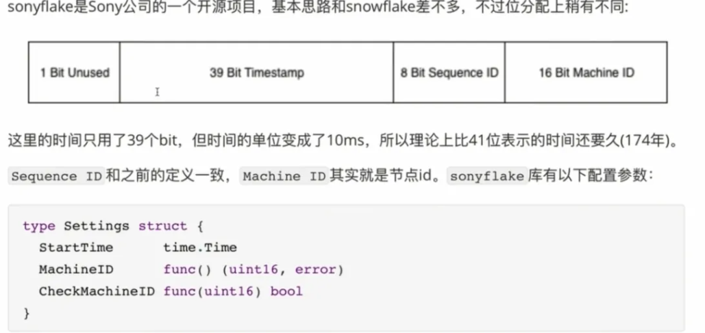

## 分布式ID生成算法 | 雪花算法 | GO实现

### 分布式ID特点
+ 全局唯一性:不能出现有重复的ID标识，这是基本要求
+ 递增性:确保生成ID对于用户或业务是递增的
+ 高可用性:确保任何时候都能生成正确的ID
+ 高性能性:在高并发的环境下依然表现良好

不仅仅是用于用户ID，实际互联网中有很多场景需要能够生成类似MySQL自增ID这样不断增大，同时又
不会重复的id。以支持业务中的高并发场景。比较典型的场景有:电商促销时短时间内会有大量的订单涌入到系统，比如每秒10w+;明星出轨时微
博短时间内会产生大量的相关微博转发和评论消息。在这些业务场景下将数据插入数据库之前，我们需
要给这些订单和消息先分配一个唯-ID,然后再保存到数据库中。对这个id的要求是希望其中能带有一
些时间信息，这样即使我们后端的系统对消息进行了分库分表，也能够以时间顺序对这些消息进行排

### 雪花算法(世界上没有完全相同的两片雪花)

雪花算法的本质是生成一个64位的 long int 类型的id，可以拆分成一下几个部分：
+ 最高位固定位0。因为第一位为符号位，如果是1那么就是负数了。
+ 接下来的 41 位存储毫秒级时间戳，2^41 大概可以使用69年。
+ 再接来就是10位存储机器码，包括  5 位dataCenterId 和 5 位 workerId。最多可以部署2^10=1024台机器。
+ 最后12位存储序列号。统一毫秒时间戳时，通过这个递增的序列号来区分。即对于同一台机器而言，同一毫秒时间戳下可以生成 2^12=4096 个不重复id。

**雪花算法其实是强依赖于时间戳的,如果发生了时钟回拨有可能会发生生成相同id。所以雪花算法适合那些与时间有强关联的业务 ，比如订单，交易之类的，需要有时间强相关的业务。**

### 生成ID流程图

### 代码实现

#### 前置工作
定义常量

    timestampBits = 41 // 时间戳的 占用位数
    dataCenterIdBits = 5 // dataCenterId 的占用位数
    workerIdBits = 5 // workerId 的占用位数
    seqBits = 12 // sequence 的占用位数

并且定义各个字段的最大值，防止越界

    // timestamp 最大值, 相当于 2^41-1 = 2199023255551
    timestampMaxValue = -1 ^ (-1 << timestampBits)
    // dataCenterId 最大值, 相当于 2^5-1 = 31
    dataCenterIdMaxValue = -1 ^ (-1 << dataCenterIdBits)
    // workId 最大值, 相当于 2^5-1 = 31
    workerIdMaxValue = -1 ^ (-1 << workerIdBits)
    // sequence 最大值, 相当于 2^12-1 = 4095
    seqMaxValue = -1 ^ (-1 << seqBits)

移动位数
    
    // workId 向左移动12位（seqBits占用位数）因为这12位是sequence占的
    workIdShift = 12
    // dataCenterId 向左移动17位 (seqBits占用位数 + workId占用位数)
    dataCenterIdShift = 17
    // timestamp 向左移动22位 (seqBits占用位数 + workId占用位数 + dataCenterId占用位数)
    timestampShift = 22

定义雪花生成器的对象，定义上面我们介绍的几个字段即可
    
    type SnowflakeSeqGenerator struct {
        mu           *sync.Mutex
        timestamp    int64
        dataCenterId int64
        workerId     int64
        sequence     int64
    }

    func NewSnowflakeSeqGenerator(dataCenterId, workId int64) (r *SnowflakeSeqGenerator, err error) {
        if dataCenterId < 0 || dataCenterId > dataCenterIdMaxValue {
            err = fmt.Errorf("dataCenterId should between 0 and %d", dataCenterIdMaxValue-1)
            return
        }
        if workId < 0 || workId > workerIdMaxValue {
            err = fmt.Errorf("workId should between 0 and %d", dataCenterIdMaxValue-1)
            return
        }
        return &SnowflakeSeqGenerator{
            mu:           new(sync.Mutex),
            timestamp:    defaultInitValue - 1,
            dataCenterId: dataCenterId,
            workerId:     workId,
            sequence:     defaultInitValue,
        }, nil
    }

### GO实现snowflake
1. [snowflake的GO实现--轻量] https://github.com/bwmarrin/snowflake

2. https://github.com/sony/snoyflake
